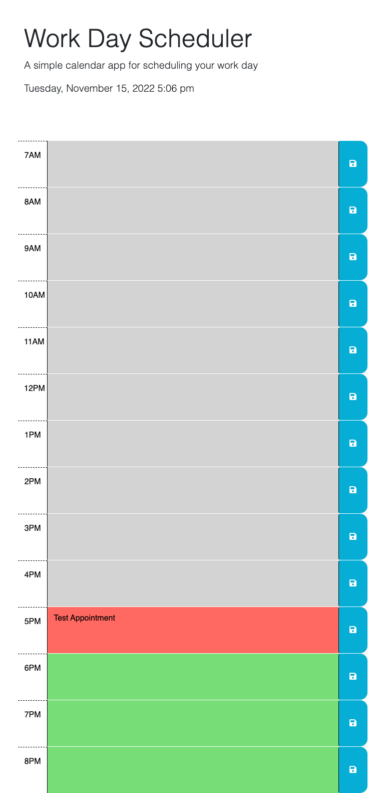

# work-day-scheduler
Coding Bootcamp Challenge #5 - Third-Party APIs

## Description

This project is meant to run as a day-by-day scheduler. The base code gave us HTML for the time blocks but we were asked to add the dynamic functionality to the base. The updated code includes:

- Responsive CSS coding that changes the time blocks to reflect past, present, or future. 
- Input values that are stored locally in the client-side storage. 
- Running time clock at the head of the page. 

This project was challenging to get the local storage to properly populate. What I have currently in my code is not the most elegant JavaScript but it does work to some degree!  

## Installation

NA

## Usage

This application is day-to-day schedulers and future employers to see my work through JavaScript. 

https://ecussler.github.io/work-day-scheduler/

## Credits

Credit to my fellow students for giving me feedback and help with my local storage issues. 

Credit to crispy-octo-meme for the starter code: https://github.com/coding-boot-camp/crispy-octo-meme

## License

Please refer to the LICENSE in the repo. 
